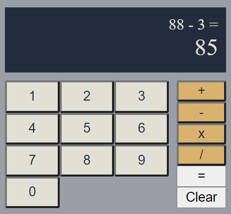

# HTML calculator

## Purpose?

This website is mostly being created "for fun". Extra time spent on a plane ride, writing code never hurt anyone. Let's have some fun writing code and styling some buttons.

## Simple Features

- Addition
- Subtraction
- Multiplication
- Division

## Image of working calculator

## Potential Additions

- decimals
- animations?
- scientific (more complex expressions)
